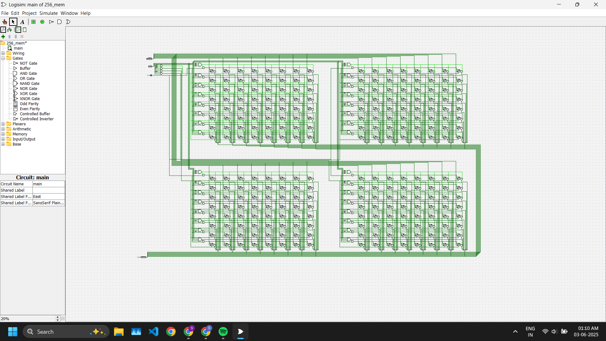

# 256-bit-RAM-Memory-Array-Logisim
This project implements a 256-bit memory array (4 × 8 × 8) from scratch using **Logisim**. It demonstrates key concepts in digital memory architecture design including hierarchial address decoding logic, write-enable control, synchronous storage and modular memory scaling.

---

## 📐 Project Overview
This project emulates memory block behavior at the gate level using flip-flops and decoders. The modular design supports easy expansion to higher memory capacities.

- **Memory Size**: 4 modules × 8 rows × 8 bits = **256 bits**
- **Address Width**: 5 bits (`ADDR[4:0]`)
  - **2 MSBs** → Block selection (0–3) via **2-to-4 decoder**
  - **3 LSBs** → Row selection (0–7) within block via **3-to-8 decoder**
- **Write Enable**: Synchronous using rising clock edge
- **Data Width** : 8 bits
- **Access**: Manual read/write using input control
- **Design Style**: Modular and block-based for scalability
- **Tools Used**: Logisim Evolution

---

## 🧱 Component Statistics (from Logisim)

| Component   | Count |
|------------|--------|
| D Flip-Flops | 256 |
| AND Gates    | 324 |
| NOT Gates    | 52  |
| OR Gates     | 32  |
| Pins         | 7   |
| Splitters    | 6   |
| Labels       | 1   |
| **Total**    | **678** Components |

---

## 🧠 Features

- Modular block architecture using four 8 × 8 RAM Arrays.
- Manual 2-to-4 decoder for selecting memory block.
- Manual 3-to-8 decoder for row selection.
- D Flip-Flop based synchronous storage.
- 1 Byte-wide data storage capacity.
- Separate block selection for parallelism.
- Address-mapped input control (address, WE, CLK)
- Separate output buses from each block (out1, out2, out3, out4) to avoid bus contention.
- Grid-style 2D layout mimicking SRAM cell structures
- Visual clarity and real-world memory behavior.

---

## 🛠 Circuit Overview
**Inputs:**
- `Address[4:0]`
  - `Address[4:3]` → Selects 1 of 4 blocks
  - `Address[2:0]` → Selects 1 of 8 rows inside the selected block
- `Data[7:0]` → Data to be written
- `WE` → Write Enable (High = Write, Low = Read)
- `CLK` → Clock (rising-edge triggered)

**Outputs:**
- Each block has a separate 8-bit output bus:
  - `Out0[7:0]` for Block 0
  - `Out1[7:0]` for Block 1
  - `Out2[7:0]` for Block 2
  - `Out3[7:0]` for Block 3

--- 

## 🐞 Issues and Bugs Resolved
- ✅ Fixed output overlap by using independent buses per block
- ✅ Corrected MSB/LSB mapping in both 2-to-4 and 3-to-8 decoders
- ✅ Verified all 32 memory locations with manual and scripted test cases

## 📸 Screenshot

---

## 🖥️ Running the Project
1. Open using Logisim Evolution.
2. Load the circuit file: `main.circ.`
3. Set `Address`, `Data`, `WE`, and `CLK` appropriately to write.
4. Toggle `CLK` to store data.
5. Set `WE = 0` and change address to read stored data from the appropriate block output.

---

## 👨‍💻 Author

**Sarthak Aggarwal**  
B.Tech, ECE — Delhi Technological University  
Passionate about VLSI, SoC Design, and Memory Architecture  
📧 sarthakaggarwal30102003@gmail.com  
🔗 [LinkedIn Profile](https://www.linkedin.com/in/sarthak-aggarwal-486b60240/)

---

> This repository is open for contributions, suggestions, and forks. Feel free to drop feedback or fork the project!

